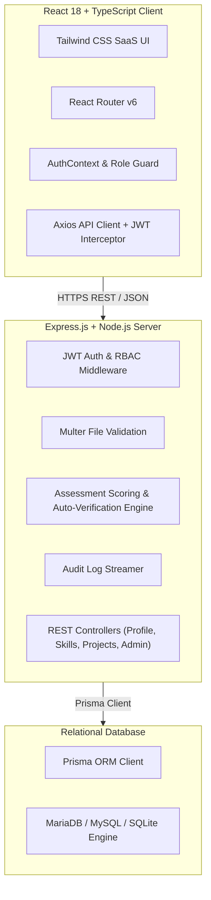

# SKILLPROOF: Skill Verification & Developer Portfolio Platform

> **"Can this developer actually prove the technical skills they claim?"**

SKILLPROOF is a complete, production-grade database-backed full-stack web application built to eliminate resume inflation through verifiable technical skill evidence. It enables software engineers to validate technical capabilities via timed multiple-choice coding assessments, project code documentation, and verified certification badges. Recruiters can search, filter, evaluate proof evidence, and bookmark top talent.

---

## 🏗 System Architecture Diagram



---

## 🛠 Tech Stack

### Frontend:
- **React 18** with **TypeScript**
- **Vite** for fast HMR bundling
- **React Router v6** for client-side protected routing
- **Axios** with JWT bearer request interceptors
- **Tailwind CSS** for modern SaaS dark theme UI styling
- **Lucide React** icons

### Backend:
- **Node.js** & **Express.js** (TypeScript)
- **JWT (JSON Web Tokens)** for stateless authentication
- **Bcrypt** for salt-and-hash password security
- **Multer** for file upload type/size sanitization
- **Zod** for strict request schema validation

### Database & ORM:
- **Prisma ORM v5** (SQLite default out-of-the-box local execution, fully compatible with **MariaDB / MySQL 8.0**)
- Raw SQL DDL schema provided in `database/schema/schema.sql`

---

## 📁 Monorepo Project Structure

```
skillproof/
├── client/                     # React Frontend Application
│   ├── src/
│   │   ├── components/        # Navbar, Footer, VerifiedBadge, ProgressBar, Modal, Skeletons
│   │   ├── context/           # AuthContext (JWT & User state)
│   │   ├── pages/             # Landing, Login, Register, Dashboards, Skills, Projects, Assessments, Admin, Portfolio
│   │   ├── routes/            # AppRoutes & ProtectedRoute RBAC guards
│   │   ├── services/          # Axios API client instance
│   │   ├── types/             # TypeScript interfaces for API models
│   │   └── utils/             # Formatters & completion helpers
│   └── package.json
│
├── server/                     # Express REST API & Verification Engine
│   ├── prisma/
│   │   └── schema.prisma      # Prisma schema (18 models)
│   ├── src/
│   │   ├── config/            # Database singleton (db.ts)
│   │   ├── controllers/       # Auth, Profile, Skills, Projects, Assessments, Verifications, Recruiter, Admin
│   │   ├── middleware/        # JWT Auth, Role RBAC, Multer upload, ErrorHandler
│   │   ├── routes/            # Express routers
│   │   ├── seed.ts            # Realistic TypeScript Database Seeder
│   │   ├── tests/             # Integration test suite (runTests.ts)
│   │   ├── utils/             # JWT, Bcrypt, AuditLog, ProfileCompletion Math
│   │   ├── validators/        # Zod request validators
│   │   └── app.ts             # Express entrypoint
│   └── package.json
│
├── database/                   # MariaDB / MySQL Schemas & Exports
│   ├── schema/
│   │   └── schema.sql         # Production MariaDB DDL schema export
│   └── seed/
│
├── uploads/                    # Physical storage for avatars & proof documents
├── README.md                   # Project Documentation
└── package.json                # Monorepo workspace scripts
```

---

## 🔑 Development Seed Demo Credentials

> [!IMPORTANT]
> Use these pre-seeded accounts to explore role-based capabilities immediately after running `npm run db:seed`.

| Role | Email | Password | Access & Capabilities |
| :--- | :--- | :--- | :--- |
| **Admin** | `admin@skillproof.dev` | `Admin@123` | Platform Control Center, Verification Queue Review, User Suspend/Activate, Audit Logs |
| **Recruiter** | `recruiter1@techcorp.com` | `Recruiter@123` | Talent Search, Verified Filters, Candidate Bookmarking |
| **Developer** | `arjun@skillproof.dev` | `Dev@123` | Profile Completion (90%), Take Quizzes, Add Projects, Upload Verification Proof |

---

## ⚡ Quick Start & Installation Guide

### Prerequisites
- Node.js (>= v20.0.0)
- npm (>= v10.0.0)

### 1. Clone & Setup Workspace
```bash
git clone https://github.com/your-username/skillproof.git
cd skillproof
npm run install:all
```

### 2. Configure Environment Variables
```bash
# Server Environment (.env created automatically in server/.env)
PORT=5000
NODE_ENV=development
CLIENT_URL=http://localhost:5173
JWT_SECRET=skillproof_super_secret_jwt_key_2026_prod_quality
DATABASE_URL=file:./dev.db
UPLOAD_DIR=../uploads
```

### 3. Initialize Database & Run Seeder
```bash
# Push database schema & generate Prisma Client
npm run db:migrate

# Seed 5 Developers, 2 Recruiters, 1 Admin, Skills & Timed Assessments
npm run db:seed
```

### 4. Start Development Servers
```bash
# Runs Express Backend (port 5000) and Vite Frontend (port 5173) concurrently
npm run dev
```

Visit **`http://localhost:5173`** in your browser.

---

## 📊 REST API Overview

| Method | Endpoint | Description | Auth Required |
| :--- | :--- | :--- | :--- |
| `POST` | `/api/auth/register` | Register new Developer or Recruiter account | Public |
| `POST` | `/api/auth/login` | Authenticate & return JWT token | Public |
| `GET` | `/api/auth/me` | Fetch authenticated user profile & skills | Bearer JWT |
| `GET` | `/api/profile` | Get logged-in developer profile | Bearer JWT |
| `PUT` | `/api/profile` | Update profile details (recalculates completion %) | Bearer JWT |
| `POST` | `/api/profile/avatar` | Upload profile image via Multer | Bearer JWT |
| `GET` | `/api/profile/developer/:username` | Fetch public portfolio data | Public |
| `GET` | `/api/skills` | Master skills catalog | Public |
| `POST` | `/api/skills/user` | Add skill with proficiency level | Bearer JWT |
| `DELETE` | `/api/skills/user/:id` | Remove skill from developer profile | Bearer JWT |
| `GET` | `/api/projects` | List developer projects | Bearer JWT |
| `POST` | `/api/projects` | Create new project with tech tags | Bearer JWT |
| `POST` | `/api/projects/:id/image` | Upload project cover image | Bearer JWT |
| `GET` | `/api/assessments` | Browse available timed technical quizzes | Bearer JWT |
| `POST` | `/api/assessments/:id/start` | Start timed assessment attempt | Bearer JWT |
| `POST` | `/api/assessments/:id/submit` | Evaluate answers, score attempt & auto-verify skill | Bearer JWT |
| `GET` | `/api/verifications` | View verification requests | Bearer JWT |
| `POST` | `/api/verifications` | Submit proof document verification request | Bearer JWT |
| `GET` | `/api/recruiters/developers` | Filtered paginated developer candidate search | Public / Recruiter |
| `POST` | `/api/recruiters/bookmarks` | Save developer candidate bookmark | Recruiter / Admin |
| `GET` | `/api/admin/dashboard` | Aggregated platform metrics & charts | Admin |
| `PUT` | `/api/admin/verifications/:id` | Approve or Reject skill verification request | Admin |
| `PUT` | `/api/admin/users/:id/status` | Suspend or Activate user account | Admin |
| `GET` | `/api/admin/audit-logs` | Stream system security audit logs | Admin |

---

## 🧪 Running Automated Tests

```bash
# Run backend integration tests (Auth, Passwords, Scoring, Completion, Seeding)
npm test
```

---

## 🛡 Security Highlights

- **No Plaintext Passwords**: Passwords hashed using Bcrypt with salt factor 10.
- **Role-Based Access Control (RBAC)**: Strict server middleware checking `DEVELOPER`, `RECRUITER`, and `ADMIN` privileges.
- **Upload File Validation**: File type validation (PNG, JPG, PDF only) and safe filename sanitization to prevent directory traversal.
- **Input Validation**: Request body parsing with Zod schemas.

